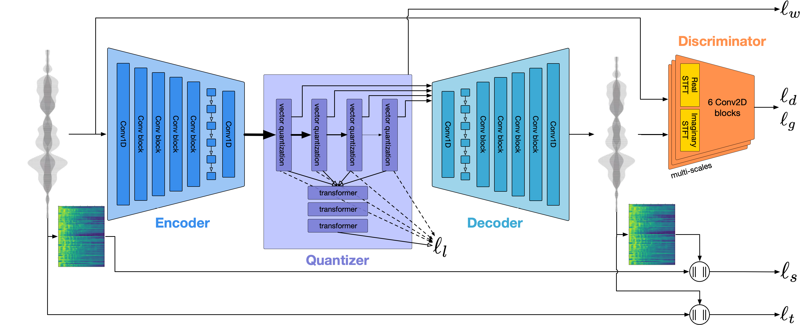

# HiFi-VAEGAN
[English](README.md)  **简体中文**

## 0. 介绍
** 该网络相当于encodec去掉了了RVQ，图参考encodec即可 **

**本项目是encodec的非官方实现。训练框架来自[so-vits-svc](https://github.com/svc-develop-team/so-vits-svc).**

## 1. 安装

### 安装 pytorch: 

https://pytorch.org/get-started/locally/

### 安装依赖 (推荐使用conda):
```
conda create -n hifi-vaegan python=3.10
```
```
conda activate hifi-vaegan
```
```
pip install -r requirements.txt
```
## 2. 准备数据
您可以使用任何高质量数据，包括但不限于人声，乐器声，并且不需要进行分类。

把所有数据放置在"dataset_raw"文件夹下面，不要出现文件夹嵌套。
## 3. 预处理
```
python resample.py
```
## 4. 修改配置文件
```
python preprocess_config.py
```
然后您可以修改位于以下路径的配置文件: configs\config.json

**log_interval:** 日志记录间隔，单位是步

**eval_interval:** 验证间隔，单位是步

**learning_rate:** 学习率

**batch_size:** 尽可能调大，利用上所有的显存

**fp16_run:** "False"使用fp32，"True"使用**half_type**控制训练精度

**half_type:** 从bf16，fp16中选择

**lr_decay:** 每轮结束后学习率的衰减率

**segment_size:** 切片长度，请在batch_size和本选项找到一个平衡点

**keep_ckpts:** 保存多少个检查点

**all_in_mem:** 如果您有TB级别的内存大小，打开可以稍微加速训练，减小硬盘瓶颈

## 5. 训练
```
python train.py -m <Experiment name>
```
## 6. Tensorboard
```
tensorboard --logdir=logs --load_fast=False
```
